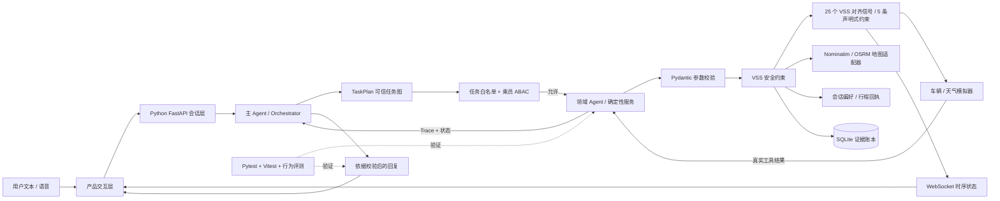

# CabinGuard

<div align="center">

### 可信智能座舱协同 Agent

让大模型负责理解与规划，让可信工具层负责状态读取、安全决策、动作执行与结果核验。

[](https://github.com/whisper621/CabinGuard/actions/workflows/ci.yml)


**[任务驾驶舱](http://localhost:3000/mission) · [数字孪生](http://localhost:3000/twin-lab) · [证据中心](http://localhost:3000/ops) · [系统架构](#可信架构) · [评测体系](#量化验证) · [项目文档](#项目文档)**

</div>

---

## 30 秒了解项目

CabinGuard 解决的不是“车载助手能否聊天”，而是“它能否在真实约束下把任务安全、可验证地做完”。

当用户说“把天窗开一半”时，系统不会立刻执行：它会先读取车速和天气；高速场景要求一次性明确确认，降雨场景由服务端直接阻止。只有工具返回真实成功结果后，Agent 才能向用户反馈“已完成”。

| 维度 | 项目成果 |
| --- | --- |
| 产品场景 | 空调、天窗、车窗、座椅、氛围灯、除霜、真实道路导航、补能、后备箱、会话记忆 |
| Agent 能力 | 主 Agent 编排、导航领域隔离、多轮 Tool Calling、组合任务、澄清、风险确认、偏好/行程回忆 |
| 可信机制 | TaskPlan 工具白名单、四类乘员 ABAC、25 个 VSS 对齐信号、5 条声明式约束、结果依据校验 |
| 可观测性 | SQLite 因果证据账本、状态版本、WebSocket 信号流、任务节点、策略裁决与工具回执 |
| 评测资产 | 24 个组合任务契约 + 15 个模型可靠性任务、91 条 Python 测试、39 条 TypeScript 测试 |
| 作品集资产 | 任务驾驶舱、场景仿真、执行追溯、可靠性评测、技术架构、PRD 与决策记录 |

> 项目定位：一个主编排 Agent + 一个导航领域 Agent + 四个确定性服务的可信座舱协同系统。当前使用车辆与环境模拟数据验证产品策略，不连接真实车辆控制器。

## 项目里到底有几个 Agent

当前主链路有 **2 个 Agent 边界**：Python `AgentService` 是面向用户的主编排 Agent；导航领域通过独立 Manifest、工具白名单、权限范围和外部服务执行器形成 `NavigationDomainAgent`。舒适、车身安全、记忆和系统感知仍是确定性服务，因为它们更需要低延迟、可审计执行，而不是额外的大模型推理。

“2 个 Agent”不代表运行两个基础大模型。当前仍由同一个 DeepSeek 客户端完成自然语言推理，领域 Agent 表示可独立版本化、隔离上下文与权限的推理/执行边界；未来只有当导航需要独立上下文、SLA 或团队维护时才拆为独立模型调用。14 个工具也绝不包装成 14 个 Agent。

仓库仍保留过往的 OpenAI Realtime 实验代码作为开发存档，但它既不与主 Agent 协作，也尚未共用 Python 可信执行器，已退出展示路径。因此不应把项目包装成“2 Agent”之外的“多智能体”。这个取舍让项目重点落在任务完成、安全授权和可验证评测，而不是用名词制造复杂度。

## 语言与代码边界

CabinGuard 现在采用产品型 Agent 常见的前后端分工，而不是为了“全 Python”牺牲交互体验：

- **Python 是 Agent 主后端：** FastAPI 接口、TaskPlan 编译、乘员/设备/座位 ABAC、证据账本、WebSocket 信号流、多轮模型编排、Pydantic 工具、真实地点/道路适配、VSS 约束、会话记忆、组合评测器和 91 条测试均在 `backend/`。
- **TypeScript/TSX 是产品界面：** Next.js、React 页面、Agent Trace、评测台和浏览器语音交互在 `src/app/`。
- **TypeScript 后端是兼容回退：** 未启动 Python API 时，界面仍可通过 Next.js Route Handlers 演示；正式讲述应以 Python Agent 主链路为核心。

因此可以准确表述为“Python/FastAPI Agent 后端 + Next.js 产品前端”，不应表述为“整个仓库只有 Python”。

## 为什么做 CabinGuard

传统车载助手常见的失败并非“没听懂一句话”，而是执行链路不可信：

1. **模糊意图被擅自补全。** “调舒服一点”缺少温度、风量或通风偏好，直接执行容易违背用户预期。
2. **动作忽略实时上下文。** 开天窗、开后备箱、补能导航都依赖车速、天气、电量和路线状态。
3. **没有执行也报告成功。** 大模型可能生成自然流畅但没有工具结果支撑的完成文案。

CabinGuard 将任务拆为一条可检查的闭环：

```text
用户目标 → 意图理解 → 状态读取 → 必要澄清/确认
        → 安全校验 → 工具执行 → 状态更新 → 结果核验
```

## 核心产品设计

### 1. 模型是规划者，不是动作权限拥有者

模型可以决定“下一步应该调用什么工具”，但不能直接修改车辆状态。所有写操作统一进入 Python/FastAPI 服务端工具执行器，由应用层完成参数、前置状态、风险和授权校验；原有 Next.js API 保留为兼容回退链路。

### 2. 风险策略同时存在于软、硬两层

- 系统提示词负责引导模型先读状态、必要时澄清并解释风险。
- 服务端工具负责最终拦截，即使模型选错工具或伪造参数，也不能绕过规则。

### 3. 成功反馈必须有工具结果作证

只有工具返回 `executed=true` 或 `navigation_started=true` 等成功副作用时，Agent 才能声称任务完成；否则回复会被约束为澄清、阻止、失败或能力边界说明。

### 4. 一个主入口，四个验证视图

- 任务驾驶舱是唯一主入口：承担自然语言任务、TaskPlan 预演、乘员权限和执行回执。
- 场景仿真、执行追溯、可靠性评测和技术架构分别验证环境变化、因果证据、质量指标和运行时边界。
- 五个页面共享同一导航、术语和深色座舱 HMI，避免把产品主流程与研发试验台混为一谈。

### 5. 真实导航是环境能力，不是额外 Agent

- 普通地址与 POI 由 OpenStreetMap Nominatim 按用户提交动作检索，道路距离、ETA、备选路线、步骤与 GeoJSON 折线由 OSRM 计算。
- 导航服务以明确的地点检索与算路工具形式参与主 Agent 编排；精确位置必须经用户授权后才会用于算路，且不写入发给模型的工具回执。
- 公共服务是无 SLA 的作品集原型数据源，不含实时交通、封路、车道级引导或量产导航能力；提供者失败时系统返回明确阻断，不以模拟折线冒充真实结果。

### 6. 能力清单与执行规则共用代码事实

- 14 个工具、25 个 VSS 对齐信号和 5 条约束统一由 Python 注册表维护，`/api/cabin/capabilities` 动态生成技术架构页，不手工伪造功能数量。
- 车窗高速限幅、儿童锁拒绝、P 挡后备箱、雨天天窗和低电量风量限制由声明式约束真正参与工具执行，并返回可机器处理的 `code`、`action` 和建议。
- 偏好与行程只保留在当前 30 分钟会话；偏好写入/删除必须来自本轮用户明确要求，行程必须来自成功导航回执。

## 场景与安全策略

| 用户任务 | 系统先读取 | 正常动作 | 风险处理 |
| --- | --- | --- | --- |
| “把空调调到 23℃” | 当前温度、风量、循环模式 | 更新目标温度与送风 | 参数越界直接拒绝 |
| “把天窗开一半” | 车速、天气 | 更新天窗与遮阳帘 | 高速需确认；降雨禁止开启 |
| “找个顺路快充” | 电量、续航、当前路线 | 返回候选站 | 不得擅自启动导航 |
| “找快充并导航” | 车辆状态、候选站 | 搜索后启动导航 | 必须有明确导航意图 |
| “导航到昌平区政府” | 当前位置、实时地点候选 | 真实道路算路并展示地图 | 只接受本会话检索出的候选 ID；外部失败不伪造 |
| “主驾车窗打开 80%” | 车速、挡位、儿童锁 | 写入对应车窗状态 | 超过 100 km/h 时自动限幅到 30%；后排儿童锁可拒绝 |
| “打开座椅通风和紫色氛围灯” | 车辆与座舱状态 | 跨座椅/灯光域组合执行 | 区域、动作、挡位、颜色和亮度严格校验 |
| “记住我喜欢 22℃” | 本轮明确记忆意图 | 写入会话偏好 | 不冒充账号级长期记忆；会话过期即清除 |
| “打开后备箱” | 车速与挡位 | 驻车时开启 | 行驶中由工具层阻止 |
| “调舒服一点” | 当前座舱状态 | 等待偏好明确后执行 | 关键条件不足时先澄清 |

## 可信架构



### 信任边界

| 层级 | 可以做什么 | 不可以做什么 |
| --- | --- | --- |
| 浏览器 | 提交文本、会话 ID、有限历史；展示 Trace | 提交并覆盖可信车辆状态 |
| 大模型 | 理解意图、选择工具、组织回复 | 绕过 Schema、安全规则或直接写状态 |
| 工具执行器 | 校验参数、读取状态、执行模拟动作、记录结果 | 把失败包装成成功 |
| 模拟器 | 提供确定性车况、天气、补能和动作回执 | 代表真实车辆或量产能力 |
| 地图适配器 | 按授权检索地点并规划道路路线 | 提供实时路况、车道级引导或可用性 SLA |

详细设计见 [架构说明](docs/ARCHITECTURE.md) 与 [权限边界](documentation/permissions.md)。

## 十四个领域工具

| 工具 | 职责 | 关键约束 |
| --- | --- | --- |
| `get_vehicle_state` | 读取车速、挡位、电量、续航、位置来源、路线状态 | 车辆动作与补能任务的可信前置 |
| `get_weather` | 读取天气与降雨概率 | 天窗开启前必须调用 |
| `get_climate_state` | 读取温度、风量与循环模式 | 空调写操作前必须调用 |
| `set_climate` | 调节温度、风量与循环模式 | 严格范围与枚举校验 |
| `search_charging_stations` | 搜索顺路充电站并返回候选坐标 | 必须先读取车辆状态；当前为演示目录 |
| `start_navigation` | 启动补能导航并生成距离、ETA、路线折线 | 需要显式导航意图和本轮候选站 |
| `search_places` | 实时检索普通地点、地址与行政区 | 用户触发、缓存限流；坐标留在服务端会话 |
| `plan_navigation` | 生成真实道路距离、ETA、步骤、备选路线与折线 | 先读车辆、先检索地点、候选 ID 绑定、外部算路同意 |
| `control_sunroof` | 控制天窗与遮阳帘 | 降雨阻止，高速确认绑定会话与动作 |
| `control_trunk` | 开关后备箱 | 行驶中禁止开启 |
| `control_cabin_device` | 控制四区车窗、四席座椅加热/通风、氛围灯与前后除霜 | 先读状态；动作/区域严格配对；声明式拒绝或限幅 |
| `get_capabilities` | 读取实际工具、信号、约束与集成摘要 | 由运行时注册表生成，防止能力幻觉 |
| `manage_preferences` | 记住、列出或删除会话偏好 | 写/删需要本轮明确授权；仅当前会话 |
| `query_trip_history` | 查询最近成功导航形成的行程回执 | 最多 10 条；不接收模型自行编造的记录 |

## 五个统一入口

| 路径 | 用途 | 是否需要模型密钥 |
| --- | --- | --- |
| `/` | 自动进入任务驾驶舱，避免出现两个首页 | 同 `/mission` |
| `/mission` | v0.6 主演示：任务图预演、四类乘员权限、跨域执行与状态回执 | 预演不需要；完整执行需要 DeepSeek |
| `/twin-lab` | **场景仿真**：注入高速、驻车、降雨、低电量等时序事件，并通过 WebSocket 查看状态版本 | 否；需启动 Python API |
| `/ops` | **执行追溯**：查看 TaskPlan、ABAC 裁决、工具回执和信号事件组成的因果证据链 | 否；需启动 Python API |
| `/evaluation` | 按 Base / Hallucination / Disambiguation 运行多轮评测，展示五维得分与一致性 | 是，`DEEPSEEK_API_KEY` |
| `/system-lab` | **技术架构**：动态执行图、工具权限、VSS 信号、硬约束和真实/沙箱边界 | 否；需启动 Python API |

## 量化验证

| 验证层 | 当前结果 | 说明 |
| --- | --- | --- |
| Python Agent 测试 | **91 / 91 通过** | TaskPlan、ABAC、证据账本、WebSocket、信号注入、多轮编排、工具、VSS 约束、记忆、地图与评测 |
| TypeScript 兼容测试 | **39 / 39 通过** | 验证内置回退链路与 Python 可信语义保持一致 |
| 模型行为评测 | **15 个任务 / 3 类** | Base、Hallucination、Disambiguation 各 5 个，支持单次或 3 次重复运行 |
| 组合场景契约 | **24 / 24 通过** | 领域召回、工具白名单、DAG 节点、越权工具隔离和四类乘员策略 |
| 评测指标 | **5 维 + 3 个聚合指标** | 工具链、最终状态、策略、依据、歧义处理；试次通过率、Pass^k、Pass@k |
| v3 真实冒烟 | **D05 1 / 1 通过** | 两轮补槽后完成 23℃外循环；`deepseek-flash`，10.4 秒，8656 Token |
| 历史基线批次 | **9 / 10** | 旧版单次评测一次失败来自网络 TLS 瞬断；不冒充新版 15 任务结果 |
| 本地质量门禁 | **通过** | Ruff、Pytest、ESLint、TypeScript、Vitest、Next.js 生产构建 |
| 依赖安全检查 | **0 个已知漏洞** | `npm audit --omit=dev` |

为避免把模型随机性、网络波动和付费 API 变成每次提交的合并门槛，CI 默认只运行确定性质量门禁；真实模型回归由评测页触发并单独留档。完整记录见 [评测报告](docs/EVALUATION_REPORT.md)。

## 五分钟演示路径

1. **任务图：** 打开 `/mission`，输入“把空调调到 22 度，并导航去北京南站”，展示五节点、三领域和并行执行波次。
2. **多乘员权限：** 切换“访客”重复导航，展示模型即使调用工具也会被服务端 ABAC 拒绝。
3. **场景仿真：** 打开 `/twin-lab` 注入“高速道路”和“降雨”，观察 WebSocket 状态版本增长。
4. **同意图、不同结果：** 回到任务驾驶舱请求打开天窗，展示 VSS 服务端硬约束。
5. **执行追溯：** 打开 `/ops`，沿 `planId → taskId → policy → receipt → stateVersion` 解释执行结果。
6. **技术架构：** 打开 `/system-lab`，解释运行时能力清单和 Agent、工具、硬约束之间的边界。
7. **可靠性评测：** 打开 `/evaluation`，展示 24 条确定性契约与 15 条模型行为评测的分层质量体系。

更完整的求职讲述方式见 [作品集讲述手册](docs/PORTFOLIO_PLAYBOOK.md)。

## 快速开始

### Windows 一键演示（推荐）

首次完成下方依赖安装和 `.env.local` 配置后，可以直接在 PyCharm / VS Code 中运行根目录的 `start_demo.py`。也可以双击 `start-demo.cmd`，或在终端运行：

```powershell
npm run demo:start
```

在 Python IDE 中运行时，解释器选择 `.venv\Scripts\python.exe`，工作目录选择仓库根目录，然后直接运行 `start_demo.py`，不需要给它填写额外参数。

启动器会检查 Python/Node 环境，依次启动 FastAPI 与 Next.js，等待两个健康检查通过，并自动打开 v0.6 任务驾驶舱；运行日志直接显示在 Python IDE 控制台，进程记录写入本地 `.runtime/` 且不会提交到 Git。按 `Ctrl+C` 或点击 IDE 的停止按钮即可关闭；也可以运行：

```powershell
npm run demo:stop
```

### 环境要求

- Python 3.11+
- Node.js 20+
- npm 10+
- 可选：DeepSeek API Key、OpenAI API Key

### 1. 安装 Python Agent

PowerShell：

```powershell
git clone https://github.com/whisper621/CabinGuard.git
cd CabinGuard
python -m venv .venv
.\.venv\Scripts\Activate.ps1
python -m pip install -e ".[dev]"
```

macOS / Linux 激活命令为 `source .venv/bin/activate`。

无需模型密钥即可验证 Python 工具闭环：

```bash
python -m cabinguard demo
```

### 2. 启动 FastAPI

```bash
python -m cabinguard
```

访问 [http://127.0.0.1:8000/docs](http://127.0.0.1:8000/docs) 查看并直接调用 OpenAPI 接口。健康检查位于 `GET /api/health`。

### 3. 连接产品界面

复制环境变量文件并启用 Python API 地址：

```powershell
Copy-Item .env.sample .env.local
```

在 `.env.local` 中取消以下配置的注释：

```dotenv
NEXT_PUBLIC_CABINGUARD_API_URL=http://127.0.0.1:8000
```

另开终端启动界面：

```bash
npm ci
npm run dev
```

访问 [http://localhost:3000/mission](http://localhost:3000/mission)。任务驾驶舱、场景仿真、执行追溯、可靠性评测和技术架构页都会调用 Python 后端；v0.6 新能力必须启动 Python API。

### 4. 启用 DeepSeek Tool Calling

在 `.env.local` 中填写：

```dotenv
DEEPSEEK_API_KEY=your_deepseek_api_key
DEEPSEEK_MODEL=deepseek-v4-flash
```

可以在终端直接运行 Agent：

```bash
python -m cabinguard chat --scenario default
```

完成配置后，在任务驾驶舱输入跨域指令即可体验模型编排与工具调用。

### 5. 运行质量门禁

```bash
npm run check
```

该命令依次运行：

```text
ESLint → TypeScript → 39 条 Vitest → Ruff → 91 条 Pytest → Next.js 生产构建
```

质量脚本会优先使用仓库 `.venv` 的 Python；在 GitHub Actions 等没有 `.venv` 的环境中回退到当前 Python，因此无需先手动激活虚拟环境。

常用单项命令：

```bash
npm run lint
npm run typecheck
npm run test:run
npm run python:lint
npm run python:test
npm run python:benchmark -- --task-type disambiguation --trials 1
npm run build
```

## 项目结构

```text
CabinGuard/
├─ backend/
│  ├─ cabinguard/
│  │  ├─ api.py                     # FastAPI 与 OpenAPI 入口
│  │  ├─ agent.py                   # DeepSeek 多轮 Tool Calling 主循环
│  │  ├─ planning.py                # 可信 TaskPlan、DAG 校验与执行波次
│  │  ├─ domains.py                 # 领域 Manifest、工具与权限隔离
│  │  ├─ policy_kernel.py           # 任务白名单与四类乘员 ABAC
│  │  ├─ event_store.py             # SQLite 因果证据账本
│  │  ├─ signal_player.py           # VSS 时序场景与状态注入
│  │  ├─ evaluation_v6.py           # 24 条组合场景契约评分
│  │  ├─ tools.py                   # 14 个 Pydantic 工具与可信执行器
│  │  ├─ signals.py                 # VSS 对齐信号、分段 glob 与声明式约束
│  │  ├─ capabilities.py            # 运行时能力清单与执行图
│  │  ├─ memory.py                  # 会话偏好与行程记忆执行器
│  │  ├─ navigation.py              # 地点检索、道路算路、缓存限流与隐私边界
│  │  ├─ policy.py                  # 确认、导航授权与结果依据策略
│  │  ├─ session.py                 # 会话、TTL、限流与一次性确认
│  │  ├─ reliability.py             # 多轮运行、五维评分与 Pass 指标
│  │  └─ cli.py                     # serve / demo / chat / benchmark 入口
│  └─ tests/                        # 91 条 Python Agent、任务图、策略、事件、地图、API 与评测测试
├─ evaluation/cases.json            # Python / TypeScript 共用的 15 个版本化任务
├─ evaluation/composite_cases.json  # v0.6 的 24 个多域与权限组合场景
├─ pyproject.toml                   # Python 包、依赖和 cabinguard 命令
├─ scripts/python_exec.py           # npm 门禁的跨平台 Python 环境选择器
├─ src/app/
│  ├─ mission/                      # 任务计划预演、乘员权限与执行回执
│  ├─ twin-lab/                     # 场景仿真：WebSocket 时序车辆状态与事件注入
│  ├─ ops/                          # 执行追溯：计划、策略、工具与状态证据链
│  ├─ evaluation/                   # 三类任务、多轮轨迹、一致性与报告导出
│  ├─ system-lab/                   # 技术架构：运行时能力、权限、信号与约束
│  ├─ api/
│  │  ├─ cabin/session/             # 服务端模拟会话
│  │  ├─ deepseek/agent/            # Agent 编排、超时与结果返回
│  │  └─ deepseek/interpret/        # 结构化意图解析
│  └─ lib/
│     ├─ apiBase.ts                 # Python API / Next.js API 运行时切换
│     ├─ cabinTools.ts              # TypeScript 兼容工具执行器
│     ├─ cabinPolicy.ts             # 确认、授权与结果依据策略
│     ├─ cabinSession.ts            # 会话、待确认动作、TTL 与限流
│     └─ __tests__/                 # 39 条 TypeScript 兼容测试
├─ docs/                            # PRD、架构、评测、决策与作品集说明
├─ documentation/                   # 工程交付所需的流程、变量、权限和测试地图
└─ .github/workflows/ci.yml         # 自动质量门禁
```

## 项目文档

| 文档 | 解决的问题 |
| --- | --- |
| [文档导航](docs/README.md) | 按产品、技术、评测和求职场景快速定位材料 |
| [PRD](docs/PRD.md) | 用户问题、目标场景、成功指标与 MVP 边界 |
| [系统架构](docs/ARCHITECTURE.md) | 组件关系、信任边界、数据流与安全策略 |
| [评测方案](docs/EVALUATION.md) | 用例设计、断言方法与报告字段 |
| [评测报告](docs/EVALUATION_REPORT.md) | 基线结果、失败分析、修复与复测记录 |
| [Reliability Lab 升级决策](docs/RELIABILITY_LAB_UPGRADE.md) | 功能发散、优先级、实现范围与产品取舍 |
| [真实导航与座舱 UI 升级](docs/LIVE_NAVIGATION_UPGRADE.md) | 外部项目研究、15 个升级方向、优先级、隐私与服务边界 |
| [参考架构升级记录](docs/REFERENCE_ARCHITECTURE_UPGRADE.md) | 两个参考仓库的许可核查、意图/实现差距、15 个创意与本轮落点 |
| [混合多 Agent 演进决策](docs/MULTI_AGENT_EVOLUTION_PLAN.md) | 单 Agent 是否足够、何时拆 Domain Agent、Top 5 升级与作品集讲法 |
| [v0.6 可信出行协同升级方案](docs/V06_TRUSTED_CABIN_COPILOT_PLAN.md) | 任务图、VSS 时序数字孪生、分域委托、中文优先 HMI、评测与完整交付标准 |
| [v0.6 实施与评测报告](docs/V06_IMPLEMENTATION_REPORT.md) | 已落地代码、24 条组合场景、意图/实现差距、真实边界与下一阶段修复 |
| [决策日志](docs/DECISION_LOG.md) | 为什么这样做、替代方案和验证标准 |
| [技术报告](docs/TECHNICAL_REPORT.md) | 实现原理、复核结果与生产化差距 |
| [作品集手册](docs/PORTFOLIO_PLAYBOOK.md) | 面向 AI、互联网、具身智能和座舱 PM 的讲述重点 |

## 关键产品取舍

- **可信性优先于全自动。** 高风险动作增加一次确认成本，换取更低的误执行风险。
- **可验证优先于炫技。** 工具 Trace、最终状态和失败原因比一段“聪明回复”更重要。
- **先验证策略，再接真实设备。** 当前模拟车况便于稳定复现；真实接入前必须补充身份、权限、签名、幂等和审计。
- **确定性 CI 与模型评测分层。** 代码规则每次提交都验证，非确定性模型行为以独立批次评测。

## 当前边界与路线图

当前版本是产品与技术 MVP，不是量产车控系统：

- 车辆、天气、车控和充电站目录仍为服务端模拟数据；普通地点与道路路线来自 OpenStreetMap/Nominatim/OSRM，但不含实时路况、车道级引导或正式 SLA。
- 会话使用单进程内存存储，不具备分布式持久化和正式身份认证。
- OpenAI Realtime 与旧版交互页均已退出用户展示路径；当前核心可验证链路是 Python/FastAPI 主 Agent。
- 15 个模型任务的真实运行需要有效密钥并产生调用成本，因此不在默认 CI 中运行；任务 Schema 与评分器仍由无密钥测试覆盖。

下一阶段优先级：

1. 将当前 VSS 对齐状态扩展为 WebSocket 信号流，验证异步过渡、延迟、冲突和动作回执。
2. 加入任务幂等键、用户身份、多乘员权限和持久化审计。
3. 将组合任务编译为显式依赖图，评估安全并行执行与后台任务取消。
4. 将模型行为集扩展到 30–50 条同义、多轮、中断和恶意输入用例，并建立成功率、P95 延迟与成本趋势。
5. 通过真实目标用户访谈与可用性测试验证风险提示对信任和完成率的影响。

## 安全提示

- 不要把 API Key 写入代码或提交 `.env.local`；仓库只保留占位符 `.env.sample`。
- 不要将模拟工具连接到真实车辆执行端。
- 公网部署前必须增加鉴权、分布式限流、预算上限和持久化审计。

## License

项目采用 MIT License。第三方组件与相应许可信息见 [THIRD_PARTY_NOTICES.md](THIRD_PARTY_NOTICES.md)。
