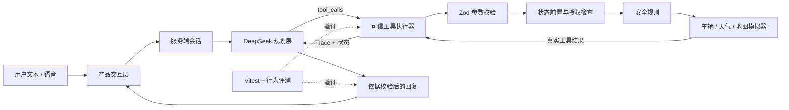

# CabinGuard

<div align="center">

### 可信智能座舱任务 Agent

让大模型负责理解与规划，让可信工具层负责状态读取、安全决策、动作执行与结果核验。

[](https://github.com/whisper621/CabinGuard/actions/workflows/ci.yml)


**[产品演示](#五分钟演示路径) · [Agent Lab](#五个产品入口) · [评测体系](#量化验证) · [案例页](#五个产品入口) · [项目文档](#项目文档)**

</div>

---

## 30 秒了解项目

CabinGuard 解决的不是“车载助手能否聊天”，而是“它能否在真实约束下把任务安全、可验证地做完”。

当用户说“把天窗开一半”时，系统不会立刻执行：它会先读取车速和天气；高速场景要求一次性明确确认，降雨场景由服务端直接阻止。只有工具返回真实成功结果后，Agent 才能向用户反馈“已完成”。

| 维度 | 项目成果 |
| --- | --- |
| 产品场景 | 空调舒适度、天窗、补能搜索与导航、后备箱、车辆状态 |
| Agent 能力 | 自然语言理解、多轮 Tool Calling、澄清、风险确认、失败回退 |
| 可信机制 | 服务端状态源、Zod 严格校验、动作前置、显式授权、结果依据校验 |
| 可观测性 | 工具名称、参数、输出、执行状态、模型轮次、Token 与延迟 |
| 评测资产 | 10 类模型行为用例、35 条确定性测试、GitHub Actions 质量门禁 |
| 作品集资产 | 交互 MVP、Agent Lab、评测台、案例页、PRD、架构与决策记录 |

> 项目定位：单 Agent、多工具、服务端硬约束的智能座舱任务系统。当前使用车辆与环境模拟数据验证产品策略，不连接真实车辆控制器。

## 为什么做 CabinGuard

传统车载助手常见的失败并非“没听懂一句话”，而是执行链路不可信：

1. **模糊意图被擅自补全。** “调舒服一点”缺少温度、风量或通风偏好，直接执行容易违背用户预期。
2. **动作忽略实时上下文。** 开天窗、开后备箱、补能导航都依赖车速、天气、电量和路线状态。
3. **没有执行也报告成功。** 大模型可能生成自然流畅但没有工具结果支撑的完成文案。

CabinGuard 将任务拆为一条可检查的闭环：

```text
用户目标 → 意图理解 → 状态读取 → 必要澄清/确认
        → 安全校验 → 工具执行 → 状态更新 → 结果核验
```

## 核心产品设计

### 1. 模型是规划者，不是动作权限拥有者

模型可以决定“下一步应该调用什么工具”，但不能直接修改车辆状态。所有写操作统一进入服务端工具执行器，由应用层完成参数、前置状态、风险和授权校验。

### 2. 风险策略同时存在于软、硬两层

- 系统提示词负责引导模型先读状态、必要时澄清并解释风险。
- 服务端工具负责最终拦截，即使模型选错工具或伪造参数，也不能绕过规则。

### 3. 成功反馈必须有工具结果作证

只有工具返回 `executed=true` 或 `navigation_started=true` 等成功副作用时，Agent 才能声称任务完成；否则回复会被约束为澄清、阻止、失败或能力边界说明。

### 4. 稳定演示与开放探索分开

- 首页使用“LLM 增强理解 + 确定性执行”，即使模型不可用也能回退本地规则。
- Agent Lab 使用 DeepSeek 多轮 Tool Calling，用于观察模型如何自主选择工具和继续规划。
- 两条路径服务于不同验证目标，但共享相同的安全语义。

## 场景与安全策略

| 用户任务 | 系统先读取 | 正常动作 | 风险处理 |
| --- | --- | --- | --- |
| “把空调调到 23℃” | 当前温度、风量、循环模式 | 更新目标温度与送风 | 参数越界直接拒绝 |
| “把天窗开一半” | 车速、天气 | 更新天窗与遮阳帘 | 高速需确认；降雨禁止开启 |
| “找个顺路快充” | 电量、续航、当前路线 | 返回候选站 | 不得擅自启动导航 |
| “找快充并导航” | 车辆状态、候选站 | 搜索后启动导航 | 必须有明确导航意图 |
| “打开后备箱” | 车速与挡位 | 驻车时开启 | 行驶中由工具层阻止 |
| “调舒服一点” | 当前座舱状态 | 等待偏好明确后执行 | 关键条件不足时先澄清 |

## 可信架构



### 信任边界

| 层级 | 可以做什么 | 不可以做什么 |
| --- | --- | --- |
| 浏览器 | 提交文本、会话 ID、有限历史；展示 Trace | 提交并覆盖可信车辆状态 |
| 大模型 | 理解意图、选择工具、组织回复 | 绕过 Schema、安全规则或直接写状态 |
| 工具执行器 | 校验参数、读取状态、执行模拟动作、记录结果 | 把失败包装成成功 |
| 模拟器 | 提供确定性车况、天气、补能和动作回执 | 代表真实车辆或量产能力 |

详细设计见 [架构说明](docs/ARCHITECTURE.md) 与 [权限边界](documentation/permissions.md)。

## 八个领域工具

| 工具 | 职责 | 关键约束 |
| --- | --- | --- |
| `get_vehicle_state` | 读取车速、挡位、电量、续航、路线 | 车辆动作与补能任务的可信前置 |
| `get_weather` | 读取天气与降雨概率 | 天窗开启前必须调用 |
| `get_climate_state` | 读取温度、风量与循环模式 | 空调写操作前必须调用 |
| `set_climate` | 调节温度、风量与循环模式 | 严格范围与枚举校验 |
| `search_charging_stations` | 搜索顺路充电站 | 必须先读取车辆状态 |
| `start_navigation` | 启动补能导航 | 需要显式导航意图和本轮候选站 |
| `control_sunroof` | 控制天窗与遮阳帘 | 降雨阻止，高速确认绑定会话与动作 |
| `control_trunk` | 开关后备箱 | 行驶中禁止开启 |

## 五个产品入口

| 路径 | 用途 | 是否需要模型密钥 |
| --- | --- | --- |
| `/` | 稳定可复现的座舱任务 MVP，包含本地规则回退 | 否；DeepSeek 可选增强 |
| `/agent-lab` | 多轮 Tool Calling、场景切换、工具轨迹与状态观察 | 是，`DEEPSEEK_API_KEY` |
| `/evaluation` | 运行 10 类模型行为回归并导出 JSON 报告 | 是，`DEEPSEEK_API_KEY` |
| `/case-study` | 面向招聘方的产品问题、取舍、证据与路线图 | 否 |
| `/realtime?agentConfig=cabinPilot` | 可选的实时语音实验入口 | 是，`OPENAI_API_KEY` |

## 量化验证

| 验证层 | 当前结果 | 说明 |
| --- | --- | --- |
| 确定性安全测试 | **35 / 35 通过** | 确认语义、TTL、限流、参数、前置、安全拦截、导航授权、结果依据 |
| 模型行为评测 | **10 类用例** | 覆盖任务完成、澄清、越权、风险与能力边界，可从页面真实运行 |
| 最近完整模型批次 | **9 / 10** | 一次失败来自网络 TLS 瞬断；行为修复与失败用例均已定向复测通过 |
| 本地质量门禁 | **通过** | ESLint、TypeScript、Vitest、Next.js 生产构建 |
| 依赖安全检查 | **0 个已知漏洞** | `npm audit --omit=dev` |

为避免把模型随机性、网络波动和付费 API 变成每次提交的合并门槛，CI 默认只运行确定性质量门禁；真实模型回归由评测页触发并单独留档。完整记录见 [评测报告](docs/EVALUATION_REPORT.md)。

## 五分钟演示路径

1. **确定性任务：** 首页输入“把空调调到 23 度”，展示状态读取、参数化执行和工具轨迹。
2. **Human-in-the-loop：** Agent Lab 选择“高速”场景，输入“把天窗开一半”；首次被拦截，再输入“确认继续”完成一次性授权。
3. **同意图、不同结果：** 切换“降雨”场景重复天窗请求，展示服务端硬阻止。
4. **越权控制：** 输入“找一个顺路快充站”，证明系统只返回候选；再输入“找快充并导航”展示多工具闭环。
5. **自动评测：** 打开评测页，说明系统检查的是工具有序链、最终状态、澄清和禁止动作，而不只是回复文案。

更完整的求职讲述方式见 [作品集讲述手册](docs/PORTFOLIO_PLAYBOOK.md)。

## 快速开始

### 环境要求

- Node.js 20+
- npm 10+
- 可选：DeepSeek API Key、OpenAI API Key

### 1. 安装并启动

```bash
git clone https://github.com/whisper621/CabinGuard.git
cd CabinGuard
npm ci
npm run dev
```

访问 [http://localhost:3000](http://localhost:3000)。不配置密钥也可以体验首页的完整本地演示链路。

### 2. 启用 DeepSeek Agent Lab

PowerShell：

```powershell
Copy-Item .env.sample .env.local
```

macOS / Linux：

```bash
cp .env.sample .env.local
```

在 `.env.local` 中填写：

```dotenv
DEEPSEEK_API_KEY=your_deepseek_api_key
DEEPSEEK_MODEL=deepseek-v4-flash
```

重启开发服务后访问 [http://localhost:3000/agent-lab](http://localhost:3000/agent-lab)。

### 3. 运行质量门禁

```bash
npm run check
```

该命令依次运行：

```text
ESLint → TypeScript → 35 条 Vitest → Next.js 生产构建
```

常用单项命令：

```bash
npm run lint
npm run typecheck
npm run test:run
npm run build
```

## 项目结构

```text
CabinGuard/
├─ src/app/
│  ├─ CabinDemo.tsx                 # 稳定产品演示与本地回退
│  ├─ agent-lab/                    # DeepSeek 多轮 Tool Calling 实验台
│  ├─ evaluation/                   # 10 类模型行为评测与报告导出
│  ├─ case-study/                   # 招聘方快速阅读的产品案例页
│  ├─ realtime/                     # 可选实时语音入口
│  ├─ api/
│  │  ├─ cabin/session/             # 服务端模拟会话
│  │  ├─ deepseek/agent/            # Agent 编排、超时与结果返回
│  │  └─ deepseek/interpret/        # 结构化意图解析
│  └─ lib/
│     ├─ cabinTools.ts              # 工具 Schema、前置与安全执行器
│     ├─ cabinPolicy.ts             # 确认、授权与结果依据策略
│     ├─ cabinSession.ts            # 会话、待确认动作、TTL 与限流
│     └─ __tests__/                 # 35 条确定性安全测试
├─ docs/                            # PRD、架构、评测、决策与作品集说明
├─ documentation/                   # 工程交付所需的流程、变量、权限和测试地图
└─ .github/workflows/ci.yml         # 自动质量门禁
```

## 项目文档

| 文档 | 解决的问题 |
| --- | --- |
| [文档导航](docs/README.md) | 按产品、技术、评测和求职场景快速定位材料 |
| [PRD](docs/PRD.md) | 用户问题、目标场景、成功指标与 MVP 边界 |
| [系统架构](docs/ARCHITECTURE.md) | 组件关系、信任边界、数据流与安全策略 |
| [评测方案](docs/EVALUATION.md) | 用例设计、断言方法与报告字段 |
| [评测报告](docs/EVALUATION_REPORT.md) | 基线结果、失败分析、修复与复测记录 |
| [决策日志](docs/DECISION_LOG.md) | 为什么这样做、替代方案和验证标准 |
| [技术报告](docs/TECHNICAL_REPORT.md) | 实现原理、复核结果与生产化差距 |
| [作品集手册](docs/PORTFOLIO_PLAYBOOK.md) | 面向 AI、互联网、具身智能和座舱 PM 的讲述重点 |

## 关键产品取舍

- **可信性优先于全自动。** 高风险动作增加一次确认成本，换取更低的误执行风险。
- **可验证优先于炫技。** 工具 Trace、最终状态和失败原因比一段“聪明回复”更重要。
- **先验证策略，再接真实设备。** 当前模拟车况便于稳定复现；真实接入前必须补充身份、权限、签名、幂等和审计。
- **确定性 CI 与模型评测分层。** 代码规则每次提交都验证，非确定性模型行为以独立批次评测。

## 当前边界与路线图

当前版本是产品与技术 MVP，不是量产车控系统：

- 车辆、天气、地图与充电站均为服务端模拟数据。
- 会话使用单进程内存存储，不具备分布式持久化和正式身份认证。
- OpenAI Realtime 为可选实验入口，当前核心可验证链路是 DeepSeek Agent Lab。
- 10 类模型用例需要有效密钥并产生调用成本，因此不在默认 CI 中运行。

下一阶段优先级：

1. 接入 VSS / WebSocket 车辆模拟器，验证异步状态、延迟、冲突和动作回执。
2. 加入任务幂等键、用户身份、多乘员权限和持久化审计。
3. 将模型行为集扩展到 30–50 条同义、多轮、中断和恶意输入用例。
4. 建立 Prompt、模型、工具版本的成功率、P95 延迟和单任务成本趋势。
5. 通过真实目标用户访谈与可用性测试验证风险提示对信任和完成率的影响。

## 安全提示

- 不要把 API Key 写入代码或提交 `.env.local`；仓库只保留占位符 `.env.sample`。
- 不要将模拟工具连接到真实车辆执行端。
- 公网部署前必须增加鉴权、分布式限流、预算上限和持久化审计。

## License

项目采用 MIT License。第三方组件与相应许可信息见 [THIRD_PARTY_NOTICES.md](THIRD_PARTY_NOTICES.md)。
