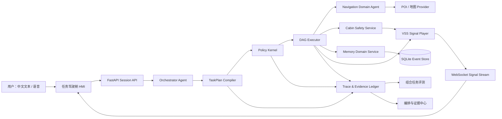

# CabinGuard v0.6：可信出行协同 Agent 升级方案

> **历史方案记录。** 本文仅描述 v0.6 的计划与当时边界；当前事实以 [CURRENT_STATUS](CURRENT_STATUS.md) 为准。

> 状态：产品与技术实施方案，尚未宣称已完成。目标是将 CabinGuard 从“可信座舱任务 MVP”升级为可支撑 AI / 互联网 / 智能座舱 / 具身智能产品岗位展示的核心作品。

## 0. 一句话定位

**CabinGuard v0.6 是一个以“可信出行任务图”为核心的智能座舱协同 Agent：它将自然语言目标拆成可预览、可授权、可回滚、可审计的跨域任务，并在 VSS 数字孪生环境中实时验证动作结果。**

不是“什么都会聊的车机助手”，也不是“为了名词堆砌的多 Agent”。它要证明的是：面对导航、舒适、车身、安全、记忆与外部信息的组合任务，系统能以低干扰方式给出正确计划、遵守权限、在失败时安全恢复，并留下可复核证据。

---

## 1. 产品战略画布

### 1.1 愿景

让驾驶者把“安排一段出行”交给一个可被理解、约束和验证的座舱协同体，而不是交给不可解释的对话模型。

坚持四项原则：

1. **任务完成优先于自然语言炫技。**
2. **确定性执行优先于 LLM 自由发挥。**
3. **驾驶安全与最小打扰优先于功能密度。**
4. **系统证据优先于口头宣称。**

### 1.2 首要用户与 JTBD

| 优先对象 | 典型情境 | Job to Be Done | 当前替代方案 | v0.6 成功结果 |
| --- | --- | --- | --- | --- |
| 城市新能源车驾驶者 | 出发前或行驶中安排一段行程 | “当我同时需要舒适调节、找地点和规划路线时，希望系统少打扰地协调任务，让我不用反复切 App，也不会误操作。” | 语音助手 + 地图 + 手动调车控 | 用户能看到任务计划、确认高风险节点，并得到有依据的结果 |
| 副驾 / 家庭乘员 | 共同出行、后排有儿童 | “当多人共享车辆时，希望每个人能获得合适体验，同时不越过主驾与儿童安全边界。” | 口头协商、手动操作 | 身份、座位、设备与场景权限可解释、可拒绝 |
| 招聘面试官 / 产品评审者 | 评估 AI 产品能力 | “当我判断一个 Agent 项目是否真实时，希望快速看清它的架构、边界、评测和失败恢复。” | 聊天窗口、静态 PPT | 3 分钟内完成一个跨域任务、一次安全拒绝、一次外部失败恢复和一次 Trace 复盘 |

### 1.3 价值主张

| 之前 | CabinGuard 如何改变 | 之后 |
| --- | --- | --- |
| 多 App、多设备、语音意图容易被误解 | TaskPlan 显式拆分目标、依赖、权限与确认点 | 用户在执行前知道系统将做什么、为何这样做 |
| 车控与模型回答混在一起，难以信任 | Policy Kernel 将 Schema、ABAC、VSS 约束、确认与回执串起来 | 动作只在满足安全和授权条件时发生 |
| Agent “说完成了”却没有系统证据 | Event Ledger + Trace + 状态版本记录每个决策与执行回执 | 结果可追溯、可调试、可评测 |
| 数字孪生只是静态 JSON | WebSocket VSS Signal Player 模拟状态变化、延迟、冲突、失败与恢复 | 可以展示接近真实车端的时序问题，而不假装连接实车 |

### 1.4 明确取舍

v0.6 **不做**：

- 不连接真实 CAN、真实车辆执行端或 OEM 账号。
- 不把每项车控功能伪装成独立 LLM Agent。
- 不做泛娱乐全家桶；媒体、电话、日程只保留可扩展接口，不抢占核心范围。
- 不在驾驶中展示高密度 Dashboard 或要求用户阅读长文本。
- 不为了架构图引入 Kafka、Kubernetes、向量数据库或多个模型服务。

### 1.5 北极星指标与本轮 OMTM

**北极星指标：可信跨域任务完成率（Trusted Cross-domain Task Completion Rate，TCTCR）。**

任务只有同时满足“计划正确、权限合规、工具结果成功、最终状态一致、反馈有依据”才计为完成。

**v0.6 的 OMTM：组合任务评测通过率。**

建议验收基线（先测当前，再设目标，不提前虚构数值）：

| 指标 | 定义 | v0.6 验收目标 |
| --- | --- | --- |
| 任务图有效率 | TaskPlan 通过 Schema、无环、依赖完整 | 100%（确定性单元测试） |
| 组合任务策略合规率 | 高风险、权限、前置与约束无违规 | 100%（确定性评测） |
| 组合任务端到端通过率 | 计划、执行、状态、依据均通过 | 首轮基线后提升，报告绝对值与置信区间 |
| 无依据成功率 | 没有成功回执却宣称完成的比例 | 0%（确定性门禁） |
| P95 任务时延 | 从提交到最终结果，按任务复杂度分层 | 首轮测量；并发读取任务需优于串行基线 |
| 可理解性 | 测试用户能复述“为何需要确认/为何被拒绝”的比例 | 5 人可用性测试中至少 4 人理解 |

---

## 2. 核心竞争力：四个可演示、可验证的差异点

### A. 可信任务图（Trustworthy TaskPlan）

把一句自然语言请求编译为严格的任务图，不直接从模型输出跳到车控。

```text
用户："有点冷，找一家附近评分高的火锅店，导航过去"

TaskPlan
├─ 读取车辆状态            [read-only, 可并行]
├─ 读取用户舒适偏好        [read-only, 可并行]
├─ 生成空调建议            [需要澄清或可执行]
├─ 搜索合规 POI 服务       [外部数据，需来源标记]
├─ 用户确认候选与导航意图  [human-in-the-loop]
└─ 规划道路路线            [依赖候选与同意]
```

每个节点至少包含：`task_id`、领域、输入、依赖、风险等级、权限要求、是否可并行、预期状态变化、失败策略和证据要求。

### B. VSS 时序数字孪生（VSS Temporal Digital Twin）

将当前静态 `VehicleState` 升级为状态流：10 Hz 可配置信号事件、版本号、动作延迟、冲突和故障注入。COVESA VSS 的目标正是提供车辆信号的语法和目录；v0.6 将其作为语义对齐层，而非声称已接入 OEM 信号。[COVESA VSS](https://covesa.github.io/vehicle_signal_specification/)

可演示场景：

- 车速由 35 km/h 上升到 110 km/h 时，未完成的车窗命令被限幅并产出回执。
- 导航执行时电量下降，补能建议状态更新但不自动改写路线。
- 前排打开除霜后，HVAC 风量、能耗和电池约束发生联动。
- 车门状态冲突、信号超时和外部 POI 失败时，任务进入恢复分支。

### C. 分域委托但不牺牲安全（Selective Domain Delegation）

将“领域 Agent”定义为可独立版本化的**推理边界**，而不是给每个 Tool 换一个名字：

| 领域 | v0.6 形态 | 是否使用 LLM | 原因 |
| --- | --- | --- | --- |
| 主编排 | `OrchestratorAgent` | 是 | 负责理解、任务拆分、汇总和澄清 |
| 舒适 / 车身安全 | `CabinSafetyService` | 否 | 设备写操作必须确定性、低延迟、可审计 |
| 导航 / POI | `NavigationDomainAgent` | 选择性 | 需要地点歧义消解、路线偏好和外部信息归因 |
| 记忆 / 偏好 | `MemoryDomainService` | 否 | 权限、撤回、持久化优先于文案生成 |
| 感知事件（后续） | `PerceptionEventAdapter` | 选择性 | 先输出结构化事件，禁止把原始多模态内容直接注入车控 Prompt |

### D. 因果证据链（Causal Evidence Ledger）

当前 Trace 升级为一次任务的因果链：`trace_id → plan_id → task_id → policy_decision → command_id → state_version → receipt`。

借鉴 OpenTelemetry 的父子 Span 模型：一个任务可由多个子操作构成，保留开始/结束、状态、属性和事件，以解释“哪一个领域、哪一条策略、哪次外部调用导致了结果”。[OpenTelemetry Traces](https://opentelemetry.io/docs/concepts/signals/traces/)

---

## 3. v0.6 可实现架构

### 3.1 架构总图



### 3.2 后端模块与工作量

| 新模块 | 关键类 / 接口 | 核心工作 | 复杂度 |
| --- | --- | --- | --- |
| `planning.py` | `TaskPlan`、`TaskNode`、`Dependency`、`RiskLevel` | 结构化规划、无环校验、风险/权限字段、计划修订 | 中高 |
| `domains.py` | `DomainManifest`、`DomainResult`、`DomainExecutor` | 领域注册、工具白名单、版本、SLA、可见上下文 | 中 |
| `dag_executor.py` | 拓扑排序、并发组、取消、重试、补偿 | 只允许安全的只读节点并发；写操作仍过 Policy Kernel | 高 |
| `policy_kernel.py` | ABAC、前置/后置条件、幂等、确认 | 主驾/乘客/儿童、座位、场景、设备权限；策略裁决回执 | 高 |
| `signal_player.py` | `SignalEvent`、`ScenarioScript`、`StateVersion` | VSS 时序、故障注入、动作延迟、冲突和回放 | 高 |
| `event_store.py` | SQLite Ledger、任务/事件/回执表 | 会话恢复、审计、评测重放、数据最小化与 TTL | 中 |
| `observability.py` | Trace Adapter、指标聚合 | `trace_id`、领域耗时、拒绝原因、成本、错误归因 | 中 |
| `evaluation_v6.py` | 组合任务集与评分器 | 计划正确性、依赖、政策、状态、依据、时延评分 | 高 |

**实现约束：** v0.6 保持单个 FastAPI 应用和 SQLite，不拆微服务。模块边界、协议和事件存储先就位；只有证明存在独立 SLA/团队需求时再拆部署单元。

### 3.3 Policy Kernel：可靠性必须落在这里

每条动作都经过同一条链路：

```text
Schema 校验
  → 身份 / 座位 / 设备 ABAC
  → 前置状态读取
  → VSS 声明式约束
  → 风险确认 / 同意
  → 幂等键与状态版本校验
  → 执行
  → 后置状态核验
  → 事件回执与 Trace
```

关键设计：

- **ABAC 而非只靠角色。** 权限由 `subject(人员)`、`resource(设备)`、`action(动作)`、`context(车速/座位/儿童锁/行程)` 共同决定。
- **乐观并发控制。** 写动作带 `expected_state_version`；状态变化后拒绝陈旧命令并重新规划。
- **幂等键。** 同一 `command_id` 重试不得重复执行动作。
- **失败补偿。** 只为可逆动作定义补偿；天窗、车窗等不得在不安全状态下盲目“回滚”。
- **数据最小化。** 精确位置、乘员偏好和事件默认会话级保留；持久化必须可查看、可撤回、可过期。

### 3.4 真正的 Domain Agent 协议

只有 `NavigationDomainAgent` 在 v0.6 尝试使用独立推理上下文。其协议必须是结构化的：

```json
{
  "planId": "plan_...",
  "taskId": "poi_search_01",
  "domain": "navigation",
  "goal": "找到满足用户约束的候选地点",
  "allowedTools": ["search_places", "plan_navigation"],
  "context": {"locationConsent": true, "routePreference": "fastest"},
  "expectedResultSchema": "DomainResult"
}
```

返回仅允许：候选、证据来源、澄清问题、建议下一步或结构化失败；它没有车辆写权限。这样“多 Agent”增加的是上下文隔离和委托能力，不增加车控风险。

### 3.5 WebSocket 信号协议

FastAPI 原生支持 WebSocket 端点，可用于 FastAPI 与 React 间实时推送信号，而不需要额外消息队列。[FastAPI WebSockets](https://fastapi.tiangolo.com/advanced/websockets/)

```json
{
  "type": "signal.update",
  "sessionId": "...",
  "sequence": 381,
  "stateVersion": 72,
  "timestamp": "2026-09-14T10:00:00Z",
  "changes": [
    {"path": "Vehicle.Speed", "value": 108, "quality": "simulated"},
    {"path": "Vehicle.Cabin.Door.Row1.DriverSide.Window.Position", "value": 30, "quality": "clamped"}
  ],
  "cause": {"commandId": "cmd_123", "constraintId": "window-high-speed-clamp"}
}
```

---

## 4. 功能范围：从“工具演示”升级为“旅程任务系统”

### P0：必须完成，形成核心竞争力

1. **任务计划与执行前预览**
   - 用户提交一句话后，先出现“任务计划”而非直接弹出结果。
   - 显示目标、步骤、依赖、风险、预计数据源、是否需要确认。
   - 用户可取消整项任务；高风险步骤必须显式确认。

2. **三域组合任务**
   - 导航 / POI、舒适 / 车身、记忆三个领域可在同一请求中协同。
   - 可并发的只读查询并发运行；有副作用的动作按依赖与策略串行。
   - 所有领域结果回流 Orchestrator，产生一条不超过两句的驾驶反馈。

3. **VSS 时序数字孪生与回放**
   - 场景脚本：高速、雨雪、低电量、儿童乘坐、外部服务失败、车门冲突。
   - 支持暂停、倍速、单步、重放；每次回放能生成可下载的事件证据。

4. **多乘员 ABAC 权限**
   - 至少支持主驾、前排乘客、后排儿童、访客四类模拟身份。
   - 权限解释为中文：谁请求、对什么设备、为什么允许/拒绝、如何继续。

5. **组合任务可靠性评测**
   - 新增 24–30 条版本化组合任务，其中至少 1/3 为风险、冲突、歧义或外部失败。
   - 七维评分：计划、依赖、工具、政策、状态、依据、恢复。

### P1：增强差异化

- POI 质量层：使用合规外部 Provider 的评分、营业状态、停车/充电等字段；没有可靠来源时明确降级为“仅地点候选”。
- 主动建议：低电量、天气、预约时间共同触发“建议”，但默认不替用户执行。
- 任务取消与补偿：可取消的地图/搜索后台任务、可逆设备动作的安全补偿。
- 成本与延迟预算：按计划 / 领域 / 外部调用显示 Token、时延、缓存命中和错误率。
- 偏好治理：查看、编辑、删除、过期和导出会话偏好；不把它称作永久用户画像。

### P2：面向具身 / 车端扩展

- 感知事件适配器：驾驶员疲劳、儿童遗留、遮挡、雨量、车外障碍等结构化事件。
- 端侧/云侧路由策略：网络不可用时只保留确定性舒适控制和本地安全规则。
- 硬件 / HIL 适配器接口：保留 Mock、Playback、Gateway 三种实现，不连接真实车辆。

---

## 5. 中文优先、科学协调的 UI / HMI 方案

### 5.1 信息架构

| 页面 | 中文主标题 | 核心任务 | 为什么存在 |
| --- | --- | --- | --- |
| `/` | **可信出行协同助手** | 30 秒理解价值和开始任务 | 面试第一屏：问题、能力、边界 |
| `/mission` | **任务驾驶舱** | 输入目标、预览计划、授权、执行 | 主演示页面，取代“只有聊天窗” |
| `/journey` | **旅程中控** | 地图、关键座舱状态、低打扰反馈 | 模拟驾驶中 HMI，不展示技术噪声 |
| `/twin-lab` | **VSS 数字孪生实验室** | 状态流、场景注入、时序回放 | 座舱/具身岗位的技术证据页 |
| `/ops` | **编排与证据中心** | TaskPlan、领域委托、Trace、策略裁决 | AI 产品/技术面深挖页 |
| `/evaluation` | **可靠性评测台** | 组合任务、指标、失败归因 | 证明不是单次演示 |
| `/system-lab` | **系统架构实验室 · System Lab** | 能力目录、信号、约束、集成边界 | 架构全景，中文为主英文为辅 |
| `/case-study` | **产品决策案例** | 用户问题、取舍、研究和路线图 | PM 面试叙事页 |

### 5.2 任务驾驶舱页面布局

```text
┌─────────────────────────────────────────────────────────────────────┐
│ CabinGuard · 可信出行协同助手              当前场景：城区行驶 · 主驾  │
├───────────────┬───────────────────────────────┬─────────────────────┤
│ 任务输入       │ 任务计划 / 执行进度             │ 旅程与状态           │
│ 中文语音 / 文本│ ① 读取状态  ✓                   │ 实时地图              │
│ [有点冷，找…] │ ② 搜索火锅候选 进行中            │ 电量 / 续航 / 路线    │
│                │ ③ 导航确认 等待你的授权          │ 舒适 / 车身关键状态   │
│ 建议任务 Chips │ 风险解释 / 数据来源 / 取消按钮   │                      │
├───────────────┴───────────────────────────────┴─────────────────────┤
│ 驾驶反馈：已找到 3 个候选，选择后我可为你规划路线。                   │
└─────────────────────────────────────────────────────────────────────┘
```

### 5.3 UI 设计系统

| 元素 | 规范 |
| --- | --- |
| 语言 | 所有用户可见文案中文优先；英语仅保留 VSS、Trace、System Lab 等行业词，并提供中文释义 |
| 字体 | `Noto Sans SC` / 系统中文字体；数字、速度、时间使用等宽数字或 Tabular Numbers |
| 色彩 | 深海蓝背景 `#07111F`；主操作导航蓝 `#2F80ED`；安全提醒琥珀 `#F4B740`；拒绝红 `#F05D5E`；成功绿 `#31C48D`；避免大面积霓虹渐变 |
| 对比度 | 正文、按钮、状态色均以 WCAG AA 为底线；颜色不作为唯一状态表达，配合文字与图标 |
| 间距 | 8pt Grid；驾驶页面优先一眼可读，驻车/实验室页面允许展开技术细节 |
| 组件 | 任务节点、权限标签、信号胶囊、状态时间线、证据抽屉、失败恢复卡、场景控制器 |
| 动效 | 仅用于状态转移、路线推进、信号更新；遵从“减少动态效果”系统偏好，禁止装饰性持续动画 |

### 5.4 全量中文化实施方法

不应在 TSX 中继续散落中英文字符串。建立：

```text
src/app/lib/i18n/
├─ zh-CN.ts          # 页面文案、空状态、错误、权限、操作词
├─ domainLabels.ts    # tool / VSS / constraint 的中文展示名称
└─ formatters.ts      # 时间、距离、温度、状态、数字格式
```

规则：

- UI 中 `control_cabin_device` 显示为“座舱设备控制”，代码名只在“技术详情”抽屉出现。
- `direct / confirm / blocked` 分别显示“可直接执行 / 需要确认 / 当前禁止”。
- `System Lab` 改为“系统架构实验室 · System Lab”；`Execution Graph` 改为“任务执行图”。
- 所有加载、空状态、定位、权限、外部服务失败、会话过期都提供明确中文和下一步操作。

---

## 6. 结果导向路线图

| 阶段 | 目标结果 | 核心交付，而非唯一目标 | 验收与证据 | 依赖 |
| --- | --- | --- | --- | --- |
| Phase 1：计划可信 | 让用户在执行前理解并控制跨域任务 | TaskPlan、计划预览、任务节点、取消/确认 | 5 个组合任务的 DAG 正确；高风险节点未确认不执行 | 现有 Agent、Tool Registry |
| Phase 2：执行可信 | 让组合任务在变化状态下安全完成或恢复 | DAG Executor、Policy Kernel、ABAC、幂等键 | 30 条组合轨迹；政策违规为 0；回执含状态版本 | Phase 1、VSS 约束 |
| Phase 3：状态可信 | 让评审者看到真实时序问题被处理 | WebSocket Signal Player、Scenario Script、Replay | 6 类信号冲突/超时场景可复现、可回放 | FastAPI、React WebSocket |
| Phase 4：证据可信 | 让 AI 决策可以被追踪、比较与复盘 | Event Ledger、Trace 关联、评测报告、指标面板 | 任意任务可追溯到计划、策略、命令、状态和回复 | SQLite、评测框架 |
| Phase 5：体验可信 | 让驾驶页面低打扰、评审页面可深挖 | 中文设计系统、Mission/Journey/Twin/Ops 页面 | 5 位可用性测试；任务理解与风险解释指标 | Phase 1–4 |

### 推荐工期与投入

- **最小强作品集版本：6–8 周。** 1 人全栈，优先 Phase 1–4，UI 先做 Mission、Twin Lab、Ops 三页。
- **完整 v0.6：10–12 周。** 加入 Phase 5、POI 质量层、用户研究、演示视频和版本报告。
- **不建议一次性做完 P2 感知/端云。** 那是 v0.7 以后，用接口、模拟事件和路线图说明即可。

---

## 7. 评测与研究：让“工作量”变成证据

### 7.1 组合任务评测设计

| 类型 | 示例 | 要检查什么 |
| --- | --- | --- |
| 正常组合 | “导航到某地，同时调到 23℃外循环” | 计划依赖、顺序、状态与最终反馈 |
| 歧义组合 | “有点冷，找家火锅店过去” | 是否先澄清温度 / 是否展示候选 |
| 权限冲突 | 后排访客要求打开儿童锁后窗 | ABAC 和儿童锁约束是否优先 |
| 时序冲突 | 车窗上升时车速突然超过阈值 | 版本校验、限幅、回执和 UI 状态 |
| 外部失败 | POI / 路由服务不可用 | 不伪造路线，给出可恢复路径 |
| 中断恢复 | 用户取消任务或切换目的地 | 取消、无重复执行、过期任务不再继续 |

### 7.2 用户研究最小集

不需要虚构大样本。按以下方式做 6–8 位访谈和 5 位可用性测试：

1. 驾驶前如何同时处理地图、空调、充电与家庭成员需求？
2. 何时愿意让助手自动执行，何时必须确认？
3. “因为儿童锁/车速/低电量被拒绝”的解释是否能理解？
4. 任务计划是降低焦虑还是增加阅读负担？
5. 用“计划预览版”和“直接执行版”各完成一次任务，比较完成时间、错误和主观信任。

输出须包括原始匿名笔记、主题归纳、需求优先级、设计修改和前后对比；不要把 5 位测试包装成统计显著性结论。

---

## 8. 作品集讲法

### 最强的三分钟演示

1. **跨域目标：** 输入“有点冷，找一家附近评分高的火锅店，导航过去”。
2. **计划与澄清：** 系统展示任务图，说明温度缺少偏好、POI 评分来源和导航需要确认。
3. **安全与执行：** 用户确认后，导航领域处理候选，座舱服务通过 Policy Kernel 调节舒适状态。
4. **状态变化：** 在 Twin Lab 注入高速/低电量事件，展示命令限幅、回执和计划调整。
5. **证据复盘：** 在 Ops 页面打开一个 `trace_id`，看到计划、领域委托、策略裁决、状态版本和最终回复。

### 简历表述（完成后才能使用）

> 设计并实现可信出行协同 Agent，将自然语言需求编译为带依赖、权限、风险和证据要求的 TaskPlan；以 VSS 对齐时序数字孪生、ABAC Policy Kernel、幂等回执和组合任务评测保障跨域执行可靠性；构建中文优先的任务驾驶舱、数字孪生实验室和编排证据中心，量化任务图有效率、策略合规率、端到端完成率与 P95 时延。

---

## 9. 上线前 Definition of Done

只有同时满足以下条件，才把 v0.6 写进简历：

- [ ] TaskPlan、领域 Manifest、DAG 执行器、Policy Kernel、Signal Player 均有单元和集成测试。
- [ ] 至少 24 条组合任务，且包含风险、冲突、取消、外部失败与恢复。
- [ ] 每个写操作都有 `command_id`、状态版本、策略裁决与后置核验。
- [ ] WebSocket 断连、重连、过期会话、乱序事件有可复现测试。
- [ ] 用户页面 100% 中文优先，技术代码名仅出现在详情层。
- [ ] Mission、Twin Lab、Ops、Evaluation 四页各有空状态、加载、失败、权限拒绝和移动端适配。
- [ ] 有至少 5 位可用性测试与一份不夸大的研究报告。
- [ ] 录制 3 分钟主线演示和 90 秒架构讲解；每个场景都可一键重置复现。
- [ ] README、技术报告、架构图、测试计数、功能边界与实际代码一致。

## 参考技术依据

- COVESA VSS 为车辆信号提供语法和目录，当前最新发布版本为 6.0；CabinGuard 仅采用其语义对齐，不代表 OEM 信号接入。<https://covesa.github.io/vehicle_signal_specification/>
- OpenTelemetry 将 Trace 定义为请求在系统中的路径，使用父子 Span 表示子操作，非常适合表达跨领域任务的因果证据链。<https://opentelemetry.io/docs/concepts/signals/traces/>
- FastAPI 提供原生 WebSocket 支持，适合作为 React HMI 与 Python 信号播放器之间的实时状态通道。<https://fastapi.tiangolo.com/advanced/websockets/>
- 多 Agent 只在上下文隔离、独立维护和并行化带来明确收益时引入；单 Agent 与确定性工作流可以混合。<https://langchain-ai.github.io/langgraph/tutorials/multi_agent/multi-agent-collaboration/>
